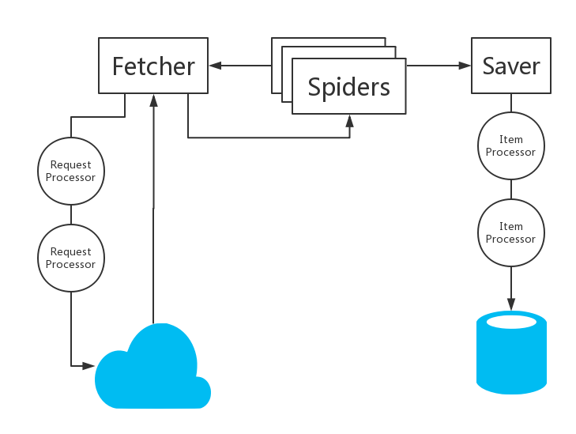
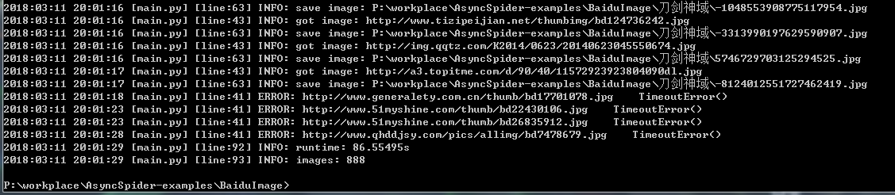
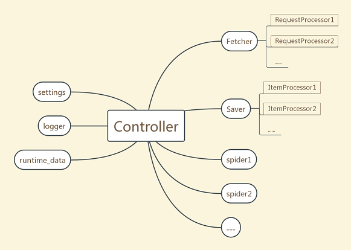

# AsyncSpider

## Framework



## Requirements

- Python 3.6+
- aiohttp
- chardet
- fake_useragent

## Installation

`pip install AsyncSpider`

## Usage

Example: [BaiduImage](https://github.com/Nugine/AsyncSpider-examples/tree/master/BaiduImage)

1. Define your item
    ```python
    class ImageItem(Item):
        url = Field()
        content = Field()
    ```

    `Item` is a `dict`-like class for storing data.But it has defined keys.
    ```python
        item=ImageItem(url='xxx')
        item['content']=b'111'
        item['abc']='cba' # raise KeyError here
    ```
    `Item.all_keys()` provides `KeysView` to access all defined keys.
    ```python
        keysview=ImageItem.all_keys()
        print(tuple(keysview)) # ('url', 'content')
    ```

    You can also custom some methods in `Item` subclass.
    ```python
        # this is a custom method
        @classmethod
        async def load(cls, spider: Spider, img_url,**kwargs):
            resp = await spider.fetch('get', img_url,**kwargs)
            return cls(url=resp.url, content=resp.content)
    ```

    When you inherit an `Item` subclass, it will inherit the superclass's fields and keys.

    `Item` has no fields.
    ```python
        class JpgItem(ImageItem):
            timestamp = Field(default=0)

        print(tuple(JpgItem.all_keys()))
        # ('url', 'content', 'timestamp')
    ```

    If a key's field has key:`'default'`, the item will set the key by default.
    ```python
        item=JpgItem()
        print(item['timestamp']) # 0

        item=JpgItem(timestamp=12345)
        print(item['timestamp']) # 12345

        # if timestamp has no default value
        item=JpgItem()
        print(item['timestamp']) # raise KeyError here
    ```

1. Define your spider
    ```python
    class BISpider(Spider):
        api = 'http://image.baidu.com/search/acjson'

        async def start_action(self):
            self.logger.info('spider start')
            yield self.parse_pages(self.settings['word'])
    ```
    The action is an `asynchronous generator` object.

    When action yield an action, spider will add it to th e action_queue.

    You can also use spider.add_action to add action.
    ```python
            await self.add_action(
                self.parse_pages(self.settings['word']))
    ```

    `Actions are parallel.`
    Avoid operating the same mutable object between actions unless you know what you are doing.

    The max number of concurrent actions is controlled by `controller.settings['concurrency']`

    However, if you get loop by `asyncio.get_event_loop()` and create tasks, the tasks are not limited by `controller.settings['concurrency']`.

    ```python
        async def get_data(self, word, pn):
            params = dict(tn='resultjson_com', ipn='rj', rn=60,
                        word=word, pn=pn)
            resp = await self.fetch('get', self.api, params=params)
            self.logger.info('got page: {}'.format(pn))
            data = resp.json()
            return data['data']
    ```
    `get_data(word,pn)` is a coroutine which is awaited by `parse_pages(word)`.

    You can send request and receive response by this.

    `resp = await self.fetch(method,url,**kwargs)`

    ```python
        async def parse_pages(self, word):
            pn = 0
            while True:
                data = await self.get_data(word, pn)
                if data[0]:
                    for img_data in data:
                        yield self.parse_img_data(img_data)
                    pn += 60
                else:
                    break
    ```

    `parse_pages` is an asynchronous generator function.

    `parse_pages(word)` is an asynchronous generator which we called "action".

    There is a `"while True"` loop in `parse_pages(word)`.This action can last very long time and yield action `parse_img_data(img_data)` continuously.

    Every action will be executed asynchronously, which means that web io will not block your spider and there is no order between actions.

    Finally, we get item by this.
    ```python
        async def parse_img_data(self, img_data):
            obj_url = img_data.get('objURL', None)
            if not obj_url:
                return
            img_url = BI_decode(obj_url)
            try:
                item = await ImageItem.load(
                    self, img_url,timeout=30)
            except Exception as exc:
                self.logger.error(img_url+'    '+repr(exc))
            else:
                self.logger.info('got image: {}'.format(img_url))
                yield item
    ```
    `yield item` is equivalent to `await self.save(item,wait=False)`

1. Define your itemprocessor
    ```python
    class ImageProcessor(ItemProcessor):
        def __init__(self, saver):
            super().__init__(saver)
            self.root = self.saver.settings['root']
            self.folder = os.path.join(
                self.root, self.saver.settings['word'])

        def on_start(self):
            if not os.path.exists(self.folder):
                self.saver.logger.info(
                    'create folder: {}'.format(self.folder))
                os.mkdir(self.folder)

        async def process(self, item: ImageItem):
            name = str(hash(item['url'])) + '.jpg'
            path = os.path.join(self.folder, name)
            with open(path, 'wb') as f:
                f.write(item['content'])
            self.saver.logger.info('save image: {}'.format(path))
    ```

1. Control your spider by `Controller`
    ```python
    settings = {
        'concurrency': 200, # required by BISpider
        'qps': 600, # required by TokenBucketRP
        'max_qps': 1000, # required by TokenBucketRP
        'root': os.getcwd(), # required by ImageProcessor
        'word': None # required by ImageProcessor and BISpider
    }

    if __name__ == '__main__':
        word = input('word: ')
        settings['word'] = word

        ctrl = Controller('BISpider')
        # ctrl.logger is at level: INFO
        # ctrl.logger.setLevel(logging.WARNING)
        ctrl.set_settings(settings)

        ctrl.construct(TokenBucketRP, RandomUserAgentRP,
                    BISpider,
                    ImageProcessor, CountItemIP)

        try:
            ctrl.run_all()
        except KeyboardInterrupt:
            ctrl.stop_all()
            ctrl.wait_all()

        ctrl.logger.info(f"runtime: {ctrl.runtime_data['runtime']}s")
        ctrl.logger.info(f"images: {ctrl.runtime_data['item_count']}")
    ```

    ctrl.logger ("BISpider") is a descendant to the logger ("AsyncSpider").

    To access the logger ("AsyncSpider"), you can write like this

    `from AsyncSpdier import logger`
    or `logging.getLogger('AsyncSpider')`

    Pattern of using Controller:
    ```python
        ctrl = Controller('project name')
        ctrl.set_settings(settings)
        ctrl.construct(...)
        ctrl.run_all()
    ```

    ctrl.construct(*classes) instantiate objects by class and put it in place automatically.

1. result



## Object reference



Lower objects (requestprocessor,itemprocessor,spider) can access controller's data by weakref.

For example:

```python
    # in requestprocessor
    self.fetcher.logger
    self.fetcher.settings
    self.fetcher.runtime_data

    # in itemprocessor
    self.saver.logger
    self.saver.settings
    self.saver.runtime_data

    # in spider
    self.logger
    self.settings
    self.runtime_data

    # they are held by controller
    ctrl.logger
    ctrl.settings
    ctrl.runtime_data
```

## API
    Please refer to source code.
## Examples

[https://github.com/Nugine/AsyncSpider-examples](https://github.com/Nugine/AsyncSpider-examples)

## Contribution

- Pull request.
- Open issue.